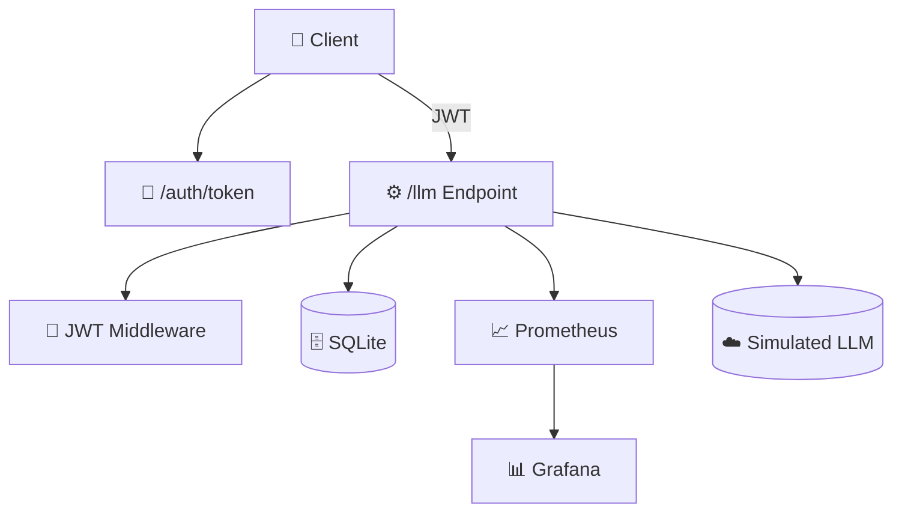

# 📊 LLMOps Dashboard

## ✨ Why This Exists

This is a **demo and prototype** of what’s possible to build yourself — using modern, open-source tools.

The goal is to **inspire LLM developers** to build their own observability layer using open standards and minimal infrastructure. It’s not a polished, production-ready framework — it’s a realistic and extensible starting point for anything from GPT APIs to local Ollama pipelines.

This stack sets up a **containerized observability system** using:

**FastAPI + Prometheus + Grafana + SQLite**

Track request latency, token usage, fallback behavior, and per-user activity — all in real time, and in a form that’s easy to modify.

> 🧪 Built for experimentation, learning, and extension — not production out-of-the-box.

* [📘 Setup & Troubleshooting Guide](HOWTO_and_TROUBLESHOOT.md)
* [🛠️ Developer Notes](README.dev.md)

> ⚠️ **Note**: This project currently supports **Linux systems**.
> ✅ Works on **WSL** for Windows users.
> 🧪 A native **Windows-compatible variant is planned**.

---

## 🔧 What It Does (Current Showcase)

| Feature                 | Description                                                    |
| ----------------------- | -------------------------------------------------------------- |
| 🔐 JWT-secured `/llm`   | Protects access and enables per-user tracking                  |
| 🧠 Fallback Simulation  | Randomized switching between `openai-gpt` and `local-ollama`   |
| 📊 Prometheus Metrics   | Captures request count, latency, token usage                   |
| 📈 Grafana Dashboards   | Visualize p95 latency + per-user traffic rates                 |
| 💾 SQLite Audit Logs    | Stores prompt + metadata for inspection/audit                  |
| 🧪 Simulation & Testing | `make simulate` and `make smoke-test` for traffic + validation |

---

## 🚀 How to Extend It

| Area        | Extension Ideas                                                                 |
| ----------- | ------------------------------------------------------------------------------- |
| 🔧 Models   | Replace simulation with real OpenAI or Ollama inference                         |
| 🛡️ Auth    | Plug in real token issuance and validation logic                                |
| 📡 Webhooks | Forward logs to Loki, Elasticsearch, or alerting systems                        |
| 📂 Uploads  | Accept documents to simulate chunking / RAG pipelines                           |
| 💵 Billing  | Add token-based cost tracking via `tiktoken` or OpenAI usage data               |
| 🔔 Alerts   | Use Prometheus alert rules for spikes, fallback behavior, or latency thresholds |

---

## 📊 Current Grafana Dashboard (Simplified + Working)

📁 `grafana/dashboards/llmops_overview.json` currently includes:

| Panel Title                 | Description                                  |
| --------------------------- | -------------------------------------------- |
| 📈 LLM Request Rate by User | Visualizes request frequency per user        |
| 📉 Latency by User (p95)    | Shows latency distribution (95th percentile) |

> ✅ Focused and stable. Additional panels (stat counters, fallback %) can be added later.

---

## 🧠 System Architecture



---

## 🚀 Quickstart

```bash
git clone https://github.com/Cre4T3Tiv3/llmops-dashboard.git
cd llmops-dashboard
make up
```

Access:

* FastAPI: [http://localhost:8000](http://localhost:8000)
* Metrics: [http://localhost:8000/metrics](http://localhost:8000/metrics)
* Grafana: [http://localhost:3000](http://localhost:3000)
  Login: `admin / admin`

---

## 🧪 Sample Request

```bash
make generate-jwt  # get token
curl -X POST http://localhost:8000/llm \
 -H "Authorization: Bearer <your-jwt-token>" \
 -H "Content-Type: application/json" \
 -H "x-user-id: demo-user" \
 -d '{"prompt": "What is vector search?"}'
```

---

## 📁 Directory Layout

```text
llmops-dashboard/
├── src/
│   ├── main.py
│   ├── auth.py
│   ├── database.py
│   └── routes/
│       ├── llm_proxy.py
│       └── token_issuer.py
├── scripts/
│   ├── simulate_llm_traffic.sh
│   ├── smoke_test.sh
│   └── reset_prometheus_data.sh
├── docker/
│   ├── docker-compose.yaml
│   └── prometheus.yml
├── grafana/
│   └── dashboards/
│       └── llmops_overview.json
├── data/
│   └── usage.db  # (created automatically)
├── .env.example
├── Makefile
├── README.md
├── README.dev.md
└── HOWTO_and_TROUBLESHOOT.md
```

---

## 🛠️ Helpful Commands

```bash
make up              # Start the full stack
make down            # Stop and clean containers
make logs            # View FastAPI logs
make shell           # Enter FastAPI container shell
make simulate        # Send demo traffic to /llm
make smoke-test      # Validate all endpoints
make generate-jwt    # Create a demo JWT for /llm requests
make reset-prometheus # Wipe Prometheus metrics history
```

---

## 🛠️ Built With

* [FastAPI](https://fastapi.tiangolo.com)
* [Prometheus](https://prometheus.io)
* [Grafana](https://grafana.com)
* [SQLite](https://www.sqlite.org/index.html)
* [Docker](https://www.docker.com)

---

## 📚 Use Cases

* Secure OpenAI request logging and analytics
* Debug model fallback logic and simulate reliability under load
* Track per-user latency and request volume
* Prototype real LLM pipelines with structured observability

---

## 📜 License

MIT — see `LICENSE`

---